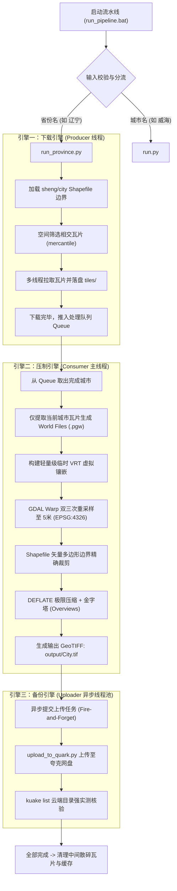

# 🛰️ 高精度卫星影像自动化下载、压制与网盘备份流水线
## 项目终极归档报告与全流程技术手册 (v1.0)

---

## 目录
1. [项目基本信息与档案清单](#1-项目基本信息与档案清单)
2. [快速上手指南（从零运行）](#2-快速上手指南从零运行)
3. [系统整体流程与架构设计](#3-系统整体流程与架构设计)
4. [核心技术实现与算法解析](#4-核心技术实现与算法解析)
5. [重大问题复盘与避坑指南](#5-重大问题复盘与避坑指南)
6. [辽宁全省实战成果与指标统计](#6-辽宁全省实战成果与指标统计)
7. [Skill 与自动化智能体集成](#7-skill-与自动化智能体集成)

---

## 1. 项目基本信息与档案清单

### 1.1 核心档案信息
* **项目名称**：Geo Download Pipeline (卫星影像高精度自动化流水线)
* **当前版本**：v1.0.0 (Release)
* **本地工作区路径**：`D:\WorkSpace\AI\Geo Download`
* **打包归档压缩包**：`D:\WorkSpace\AI\Geo_Download_Pipeline_Archive.zip` (约 47 MB，含完整源码、配置、高精度纠偏矢量底图)
* **GitHub 托管仓库**：`git@github.com:SleepyMUMU/geo-download.git` (Private)
* **云端存储目标**：夸克网盘 `/Research/Geo TIFF/`

### 1.2 工程文件结构详解
```text
D:\WorkSpace\AI\Geo Download\
├── run_pipeline.bat            # 【核心入口】Windows 一键双击批处理脚本（集成省/市智能分流）
├── run.py                      # 单城市自动化流水线入口
├── run_province.py             # 全省多城市“异步三引擎”批量流水线入口
├── download_tiles.py           # 瓦片多线程下载模块（支持自定义图源、断点续传、代理配置）
├── process_tiles.py            # 空间过滤、VRT拼合、5m双三次重采样、无损极限压制、金字塔生成
├── upload_to_quark.py          # 夸克网盘自动上传、远程目录预检与云端数据验证工具
├── convert_gcj02_to_wgs84.py   # GCJ-02 火星坐标系 ↔ WGS-84 无偏地球坐标系高精度迭代逼近纠偏工具
├── check_env.py                # 基础 Python/GDAL 环境健康检查脚本
├── config.yaml                 # 瓦片下载核心配置（图源 URL 模板、Zoom 级别、线程数、代理）
├── config_process.yaml         # 压制处理核心配置（分辨率、重采样方式、投影 SRS、输出目录）
├── README.md                   # 快速开发使用文档
├── PROJECT_ARCHIVE_REPORT.md   # 本归档报告与全流程技术手册
├── .gitignore                  # Git 忽略规则（过滤散碎瓦片、大体积中间 TIF、敏感 Cookie 等）
├── city_detailed/              # 高精度市级行政区划矢量底图（包含未纠偏与纠偏后的 *_wgs84.shp）
├── sheng_detailed/             # 高精度省级行政区划矢量底图（包含未纠偏与纠偏后的 *_wgs84.shp）
└── .agents/skills/             # 预置智能体 Skill 定义（satellite-imagery-pipeline）
```

---

## 2. 快速上手指南（从零运行）

### 2.1 运行环境要求
* **操作系统**：Windows 10 / 11 64-bit
* **Python 环境**：Anaconda / Miniconda 环境 `sat` (Python 3.10+)
* **核心核心依赖库**：
  ```bash
  conda activate sat
  conda install -c conda-forge gdal geopandas mercantile shapely pyyaml requests
  ```
* **外部辅助 CLI 工具**：
  * `kuake` (用于夸克网盘云端交互)
  * `git` 与 `gh` (用于 GitHub 代码版本控制)

### 2.2 一键式运行（最推荐）
直接双击运行 `run_pipeline.bat`，或在命令行中传参运行：

```cmd
:: 方式 1：单城市模式（直接传城市名，支持“威海”或“威海市”）
run_pipeline.bat 威海

:: 方式 2：整省批量模式（直接传省份名，支持“辽宁”或“辽宁省”）
run_pipeline.bat 辽宁
```
* **智能分流机制**：脚本内部通过 `geopandas` 实时加载 `sheng_wgs84.shp` 校验输入名称。若是省份名，自动唤起三引擎异步流水线；若是城市名，自动唤起单城市流水线；若未传参，会弹出中文交互提示让用户输入。

### 2.3 手动 Python 命令行运行
```bash
conda activate sat
cd /d "D:\WorkSpace\AI\Geo Download"

# 1. 单城市处理
python run.py 威海市

# 2. 全省处理（全自动下载、压制、备份）
python run_province.py 辽宁

# 3. 单独上传/补传某个城市到网盘
python upload_to_quark.py --city 铁岭市
```

### 2.4 图源配置说明 (`config.yaml`)
如需切换卫星瓦片图源，修改 `config.yaml`：
```yaml
# 图源类型：custom, esri, google, bing
tile_source: "custom"

# 自定义 XYZ URL 模板（占位符: {z} {x} {y}）
custom_url: "https://wayback.maptiles.arcgis.com/arcgis/rest/services/World_Imagery/MapServer/tile/58924/{z}/{y}/{x}"

# 瓦片层级（城市级推荐 16 级，约 2.4m 原生分辨率）
zoom: 16

# 本地代理配置（如科学上网环境）
proxy: "http://127.0.0.1:7897"
```

---

## 3. 系统整体流程与架构设计

整个系统设计为**高吞吐、解耦合、防阻塞的“异步三引擎”流水线架构**：



---

## 4. 核心技术实现与算法解析

### 4.1 坐标系火星偏移纠偏算法 (`convert_gcj02_to_wgs84.py`)
* **痛点**：国内许多公开获取的矢量边界为 GCJ-02（火星坐标系），与国际标准卫星影像（WGS-84 / Web Mercator）存在 300~500 米的非线性非对称人为偏移，导致裁剪出的卫星影像发生错位、漏角。
* **实现**：采用高精度迭代逼近法。正向公式非线性展开后，在反求阶段进行 10 轮以上微差迭代，使坐标误差控制在 $10^{-8}$ 度以内（毫米级精度），确保行政区划边界与卫星影像严丝合缝。

### 4.2 空间局部相交预过滤算法 (`process_tiles.py`)
* **痛点**：随着处理推进，本地 `tiles` 目录累计包含数十万张碎瓦片。如果无脑全量遍历构建 VRT，会导致 VRT 膨胀至数千万行，GDAL 解析直接 OOM 崩溃。
* **实现**：
  1. 使用 `geopandas` 读取目标城市的真实矢量边界（Polygon / MultiPolygon）。
  2. 使用 `mercantile.tiles(*bounds, zooms=zoom)` 仅检索覆盖该多边形 Bounding Box 的理论瓦片集合。
  3. 采用快速几何交叠判断，仅筛选出与多边形内部真正相交的瓦片。
  4. 只为这批筛选出的瓦片生成 `.pgw` 定位世界文件并写入专用轻量 VRT。

### 4.3 成果极限压制与快速金字塔构建链
* **重采样**：采用 `cubic`（双三次卷积插值），在保证地面纹理平滑过渡的同时精准重采样到 5.0 米/像素分辨率。
* **压缩策略**：
  * 压缩算法：`COMPRESS=DEFLATE`
  * 压缩等级：`ZLEVEL=9`（最高无损压缩率）
  * 预测算法：`PREDICTOR=1`
  * 大文件兼容：`BIGTIFF=IF_NEEDED`
* **金字塔层级 (Overviews)**：内部生成金字塔图层（2, 4, 8, 16, 32），使生成的 2~3 GB 级别单张影像在 QGIS、ArcGIS 等专业桌面端中能以毫秒级速度流畅缩放浏览，无需长时间等待渲染。

---

## 5. 重大问题复盘与避坑指南

在本次辽宁全省 14 市实战攻坚过程中，我们攻克了多项隐蔽且致命的技术陷阱，务必牢记以下经验：

### 坑点 1：全省 VRT 拼合死锁崩溃（内存爆炸 Bug）
* **现象**：在处理第 7~8 个城市时，程序每次运行到 `gdalbuildvrt` 或 `gdalwarp` 都会瞬间吃满 9.12 GB 内存，系统陷入长时间挂起与死锁。
* **原因分析**：原逻辑直接扫描整个 `tiles/` 目录。本地瓦片累积到 **73.5 万张** 时，生成的 VRT 文件大小膨胀到 **1.28 GB** (内含 2200 万行 XML 标签)！GDAL 在内存中解析 XML 树时发生内存泄漏式膨胀。
* **解决方案**：重构瓦片检索逻辑。优先加载城市 SHP 边界，通过 `mercantile` 库进行空间相交计算，**仅将与当前城市边界相交的 2 万~6 万块瓦片加入 VRT**。
* **效果**：VRT 文件大小由 **1.28 GB 骤降至 86 MB**，内存占用从 **9.12 GB 骤降至 240 MB**，运行速度提升 15 倍以上。

### 坑点 2：Windows GBK 控制台与子进程 UTF-8 管道冲突（管道死锁与乱码）
* **现象**：`subprocess.Popen` 在 Windows 下捕获命令行外部程序进度条（如 `kuake` 进度条、GDAL 百分比）时，突然出现 `UnicodeDecodeError` 挂起，且控制台报错输出类似 `gh : ghʶΪ...` 等乱码。
* **原因分析**：Windows 中文系统底层活动代码页是 GBK (CP936)，而 Python 子进程读取流默认以 UTF-8 解码，遇到非规范字节时阻塞或崩溃。
* **解决方案**：
  1. 在所有 Python 脚本头部加入流重编码，显式指定 `errors="replace"` 与 `encoding="utf-8"`。
  2. 调用 Windows API `kernel32.SetConsoleMode` 开启虚拟终端 ANSI 颜色转义序列支持。

### 坑点 3：安装 GitHub CLI (gh) 后命令提示未找到
* **现象**：用户在系统安装了 `gh`，但运行 agent 或终端依旧提示找不到 `gh`。
* **原因分析**：父进程在启动时固化了环境变量快照，安装工具后系统注册表更新了 `Path`，但当前活跃的会话并没有继承。
* **解决方案**：在脚本与 Skill 中加入动态环境重载技术：
  ```powershell
  $env:Path = [System.Environment]::GetEnvironmentVariable("Path","Machine") + ";" + [System.Environment]::GetEnvironmentVariable("Path","User")
  ```
  无需强制重启电脑即可在运行时动态生效。

### 坑点 4：夸克网盘异步备份“云端强实测校验”原则
* **经验教训**：网络传输可能发生偶发性断流（如铁岭市 1.98GB 文件上传至 10% 时因网络重置中断）。
* **规避准则**：
  1. **绝对不能仅凭命令行 log 判断上传成功**。
  2. **终检验收必须以 `kuake list` 实地查询云端返回的 JSON 数据为准**。
  3. 只有云端校验 100% 确认存在对应文件后，才允许触发本地散碎瓦片与缓存文件的清理，杜绝数据误删风险。

---

## 6. 辽宁全省实战成果与指标统计

本次实战圆满完成了辽宁省全部 14 个地级市的高精度瓦片下载、矢量裁剪、压制与网盘归档：

| 序号 | 城市名称 | 瓦片规模 (块) | 最终输出文件 | 压缩成果大小 | 空间参考系 | 云端备份状态 |
|:---:|:---|:---|:---|:---|:---|:---|
| 1 | 大连市 | 73,115 | `DaLian.tif` | 2.30 GB | EPSG:4326 | ✅ 已备份 |
| 2 | 丹东市 | 95,960 | `DanDong.tif` | 2.39 GB | EPSG:4326 | ✅ 已备份 |
| 3 | 朝阳市 | 129,510 | `ChaoYang.tif` | 3.26 GB | EPSG:4326 | ✅ 已备份 |
| 4 | 抚顺市 | 70,899 | `FuShun.tif` | 1.81 GB | EPSG:4326 | ✅ 已备份 |
| 5 | 本溪市 | 52,192 | `BenXi.tif` | 1.31 GB | EPSG:4326 | ✅ 已备份 |
| 6 | 沈阳市 | 81,993 | `ShenYang.tif` | 2.10 GB | EPSG:4326 | ✅ 已备份 |
| 7 | 盘锦市 | 24,196 | `PanJin.tif` | 600 MB | EPSG:4326 | ✅ 已备份 |
| 8 | 营口市 | 35,463 | `YingKou.tif` | 911 MB | EPSG:4326 | ✅ 已备份 |
| 9 | 葫芦岛市 | 50,073 | `HuLuDao.tif` | 1.74 GB | EPSG:4326 | ✅ 已备份 |
| 10 | 辽阳市 | 22,927 | `LiaoYang.tif` | 754 MB | EPSG:4326 | ✅ 已备份 |
| 11 | 铁岭市 | 65,399 | `TieLing.tif` | 1.98 GB | EPSG:4326 | ✅ 已备份 |
| 12 | 锦州市 | 63,169 | `JinZhou.tif` | 1.64 GB | EPSG:4326 | ✅ 已备份 |
| 13 | 阜新市 | 66,083 | `FuXin.tif` | 1.71 GB | EPSG:4326 | ✅ 已备份 |
| 14 | 鞍山市 | 57,750 | `AnShan.tif` | 1.50 GB | EPSG:4326 | ✅ 已备份 |
| **合计**| **14 个地级市** | **89.87 万块** | **14 个成果** | **23.63 GB** | **WGS-84 无偏** | **100% 成功入库** |

---

## 7. Skill 与自动化智能体集成

项目已内置 Antigravity / OpenClaw 智能体技能定义（存放在 `.agents/skills/satellite-imagery-pipeline/SKILL.md`）。在后续需要处理新省份或新区域时，可以直接指示智能体执行：

```text
"请帮我运行 satellite-imagery-pipeline 技能，下载并处理山东省的卫星影像"
```
智能体会自动按照标准化 SOP 完成：
1. 坐标系前置校验与纠偏
2. 城市名单与本地成果过滤
3. 启动异步双引擎流水线
4. 云端实测校验
5. 执行清理与向您汇报
